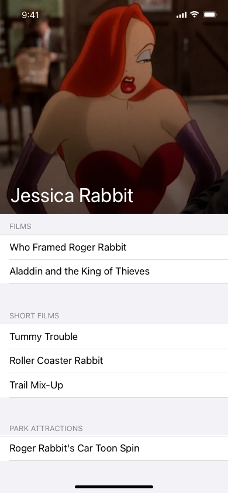

## [Disney Characters](https://disneyapi.dev/docs/)
- Display information about characters from Disney Film and TV

## Platforms
- .NET MAUI iOS and Android C# / XAML
- Build with Visual Studio 2022 / Mac or VSCode 

## Features
- Multi platform compilation
- MVVM
- Shell Navigation
- CollectionView

## Design Brief
A designer in your team has been working on an app called “Characters” and has sent you a design mockup. The app uses the Disney characters API (https://disneyapi.dev) to fetch all the characters and displays them to the user.
The app needs to have some support for offline usage even if that means the user will have a slightly degraded experience (e.g. some images won’t be shown).
Ideally, the characters should be shown in the order of popularity. Popularity is measured by how many films and park attractions the character is featured in.

You should spend no more than 3-4 hours on the project, and let us know the following
- what were your priorities, and why?
- if you had another two days, what would you have tackled next? - what would you change about the visual design of the app?
- what other features would you add to the app?

- 

